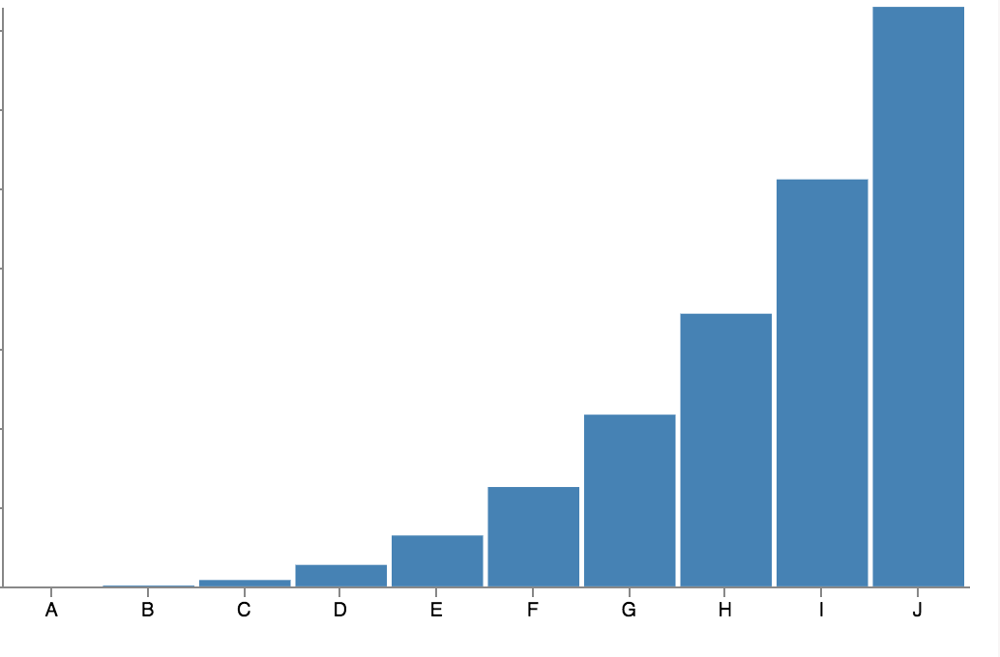
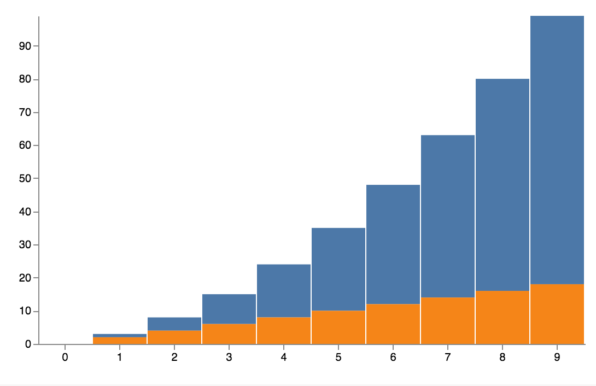

# Gust
A charting library for rust!

[](https://travis-ci.org/saresend/Gust.svg?branch=master)


**Disclaimer**
This is still very much a work in progress! APIs are very unstable and subject to change. Contributions and suggestions are welcomed and greatly appreciated! 

---
<p align="center">

</p>

## What is Gust ##

Gust is a small charting crate to make it really easy to build simple interactive data visualizations in rust. It also serves as a partial [Vega](http://vega.github.io/) implementation that will (hopefully) become more complete over time.

---

Gust allows you to render the actual visualizations themselves using D3.js, (meaning they're interactive!) as well as providing the flexibility to directly render the underlying JSON specification for Vega. 


### Currently Implementations ### 

Currently, Gust supports only 3 charts so far:

1. Bar Charts
2. Stacked Bar Charts
3. Line Charts

More will be coming soon! If you're interested in contributing your own, just make a pull request. Cheers!


## [Why did you do this in rust?](https://transitiontech.ca/random/RIIR) ## 

## Installation ## 
` gust = "0.1.4" `


## Samples and Sample Usage ## 

```rust
    use backend::bar_chart::BarChart;
    use frontend::write::render_graph;
```

### Sample Bar Chart ###
```rust
     let mut b = BarChart::new();
        let v = ["A", "B", "C", "D", "E", "F", "G", "H", "I", "J", "K", "L"];
        for i in 0..10 {
            b.add_data(v[i].to_string(), (i * i * i) as i32);
        }
        render_graph(&b, FileType::HTML).unwrap();
```
### Result: **gust_build/html/bar_chart.html** ###


### Stacked Bar Chart example ### 
```rust
use backend::stacked_bar_chart::StackedBarChart;

let mut b = StackedBarChart::new();
        for i in 0..10 {
            b.add_data(i, i * i, 1);
            b.add_data(i, i + i, 0);
        }
        render_graph(&b, FileType::HTML).unwrap();
```
### Result: **gust_build/html/stacked_bar_chart.html** ### 



## Additional Docs ## 
https://docs.rs/gust/0.1.4/gust/


## Special Mentions ## 
The rendering is all handled by Vega: https://vega.github.io/
