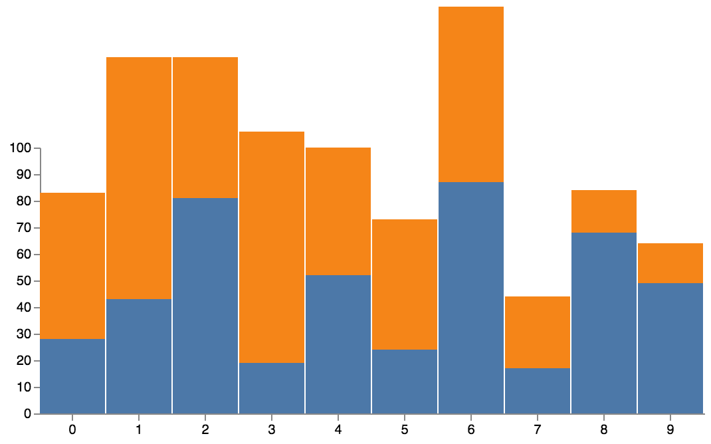

# Gust
A charting library for rust!

**Disclaimer**
This is still very much a work in progress! APIs are very unstable and subject to change. Contributions and suggestions are welcomed and greatly appreciated! 

---

## Motivation ##

I recently became obsessed with building small tools to make my development a bit more enjoyable. Gust, is one such tool! It's a small charting library that aims to make it as simple as possible to create interesting visual representations. 

## Samples ## 

## How to use it ## 